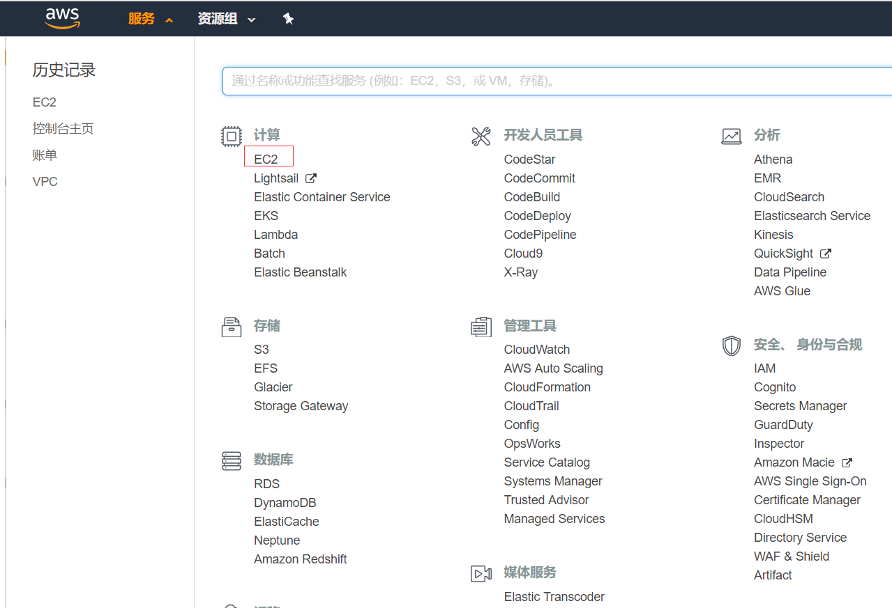
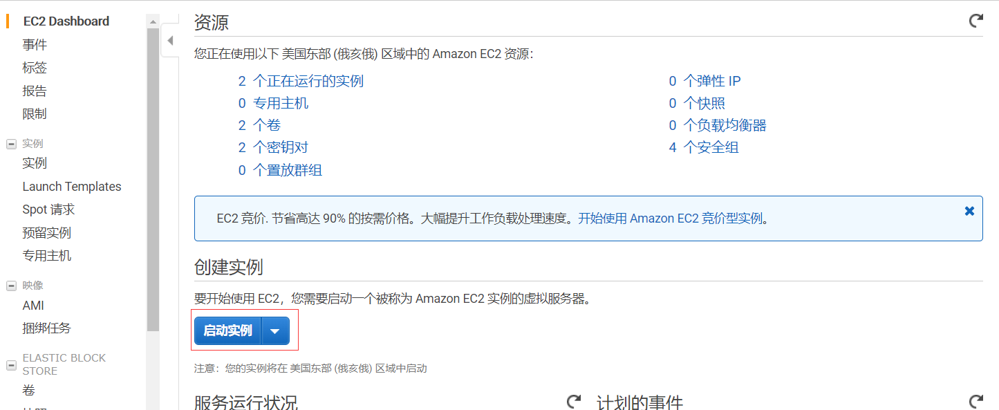
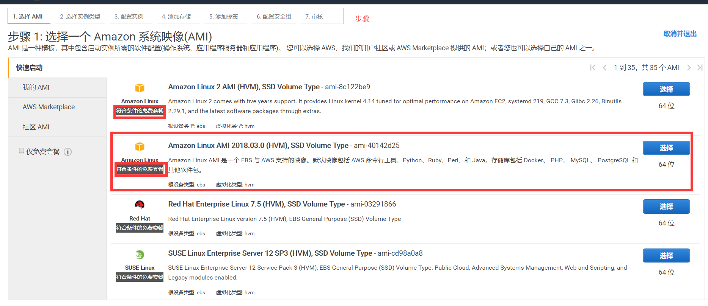
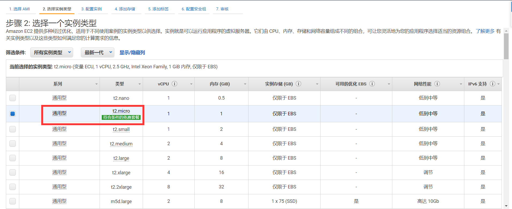
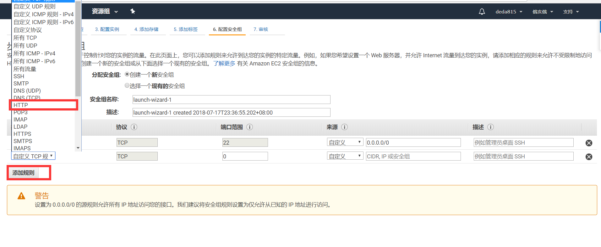
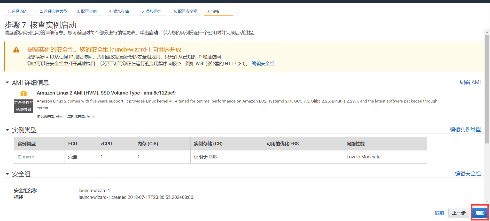
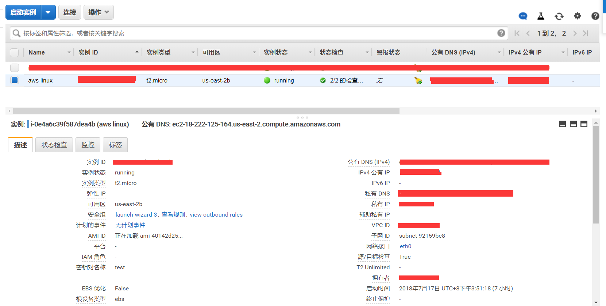
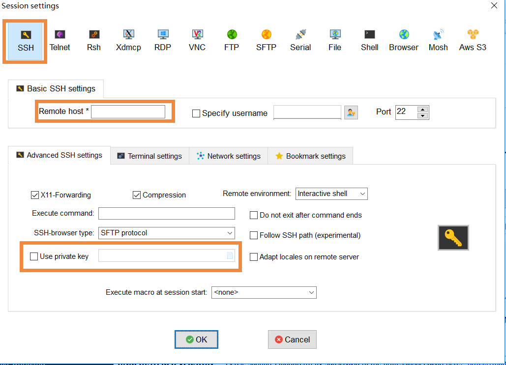
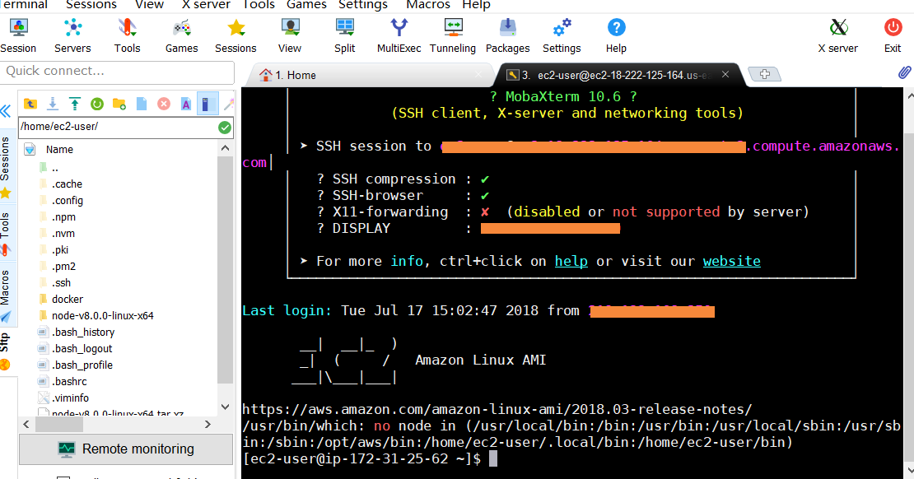
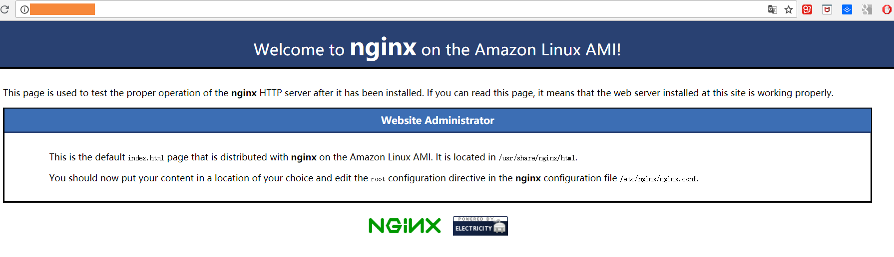

最近需要学习持续交付方面的知识，顺便学习一下docker， 本来有一个vps可以使用， 搭建基本的服务， 但是因为架构无法升级导致不支持docker， 就想换一个云主机环境， 搜了一下市面上的云主机（阿里云， 腾讯云， 金山云， 百度云， 华为云， 360云等）， 相对初学者学习而言， 成本不算低，就没有一个免费的么？ 还真找到了， AWS 业界良心啊！

AWS提供几乎全线产品一年的免费使用期限(部分服务可以永久免费)， 在这里必须要吹一波！

当然这里的主要目的不是为了吹AWS， 而是为了学习， 在EC2上跑起来最简单的hello world

### 注册账户

第一步肯定是注册账户， 如果有卓越的账户也是可以的

[aws 网址](https://aws.amazon.com/)

### 创建实例

这一步比较简单， 基本可以通过下一步提示来完成

- 1. 右上角点击`控制台` 进入控制台面板

- 2. 控制台选择进入EC2面板



- 3. 创建实例



- 4. 选择系统映像

这里有很多系统选项， 带有买免费套餐字样的都可以选择(有一半以上都是可以的， 我选了第二个， 别问为啥， 只有这一个带中文好吗)



- 5. 选择实例类型

只有一个免费类型， 所以不用纠结



- 6. 一路next， 需要注意的是在安全组这一步， 需要加一个选项
这里需要添加一个规则:http, 不然后面启动nginx后， 外部无法访问



- 7. 然后就可以启动了



- 8. 启动后就是这样的一个状态

需要注意公有DNS， 后面SSH链接时会用到



### SSH 链接

- 用到的SSH工具 
    - Putty
    - mobaXterm

- [链接过程](https://docs.aws.amazon.com/zh_cn/AWSEC2/latest/UserGuide/putty.html?icmpid=docs_ec2_console)

- 登陆



  - Remote host {用户名}@公有DNS
  - use private key选择Putty转换后的私钥

### 测试ec2

登陆成功后的界面如下



然后测试nginx

```
sudo yum update

sudo yum install nginx -y

sudo service nginx start
```

然后输入实例的ipv4 ip即可看到ec2上部署的nginx提示页面


### 总结

- aws 免费套餐非常豪华
- ec2 用起来非常爽(可以选择不同的系统创建实例)
- 安全组一定要注意添加http支持， 不然安全限制导致无法访问服务


