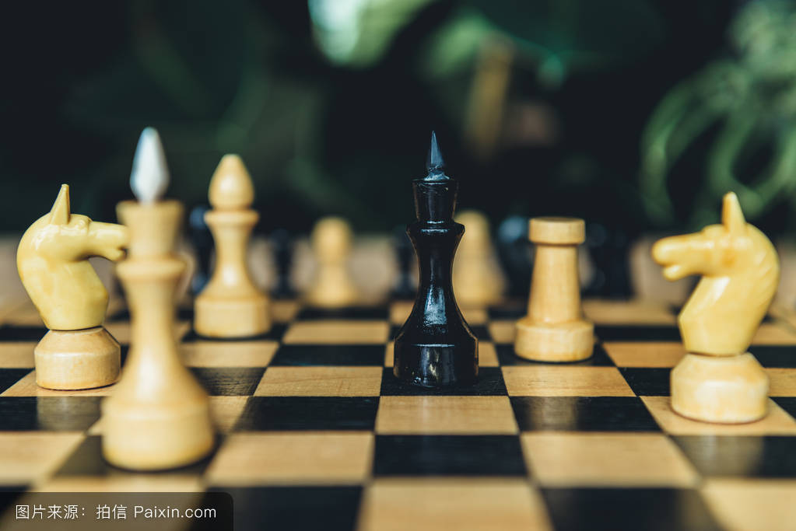

## 有关平行思考

我们工作中常用到的思考方式是垂直思考法， 简而言之就是面临一个确定的问题， 通过尝试各种办法去解决这个确定的问题， 水平思考法也是面临一个问题， 但是做法是通过不同的角度去观察这个问题进而从不同的角度去解读并定义这个问题， 进而寻找解决之法。 在真实的决策场景中，确定的问题是少数的，问题的不确定性是常态，定义一个好的问题， 往往比解决它要难得多。  

决策过程中思考活动非常复杂， 包含情感， 信息整理， 逻辑推理， 期望， 创造性等，就像一个杂技演员手中玩很多球一样， 训练有素的决策者毕竟有限， 如果有一个工具， 可以把决策中必要的思考活动进行必要的分类， 在不削减思考内容全面性的同时， 降低思考过程的复杂度，无疑可以提升决策的效率.

这本书把决策过程中的思考活动分成六个维度， 并使用不同颜色帽子指代他们：

- 白色思考帽：红色代表情绪、直觉和感情。红色思考帽提供的是感性的看法。

--- 
    我们有哪些信息
    我们需要什么信息
    我们缺乏什么信息
    我们需要征询哪些信息
    我们怎么样去获取我们所需要的信息

- 红色思考帽： 直觉， 情感， 情绪等感性认知

--- 

    一个富有经验的企业家对机会的来临比较敏感， 他积累的经验会形成强烈的直觉， 告诉他哪些生意该做， 哪些生意不能做。

    感觉无需辩解和逻辑， 可以是情感， 比如恐惧， 不喜欢， 怀疑等， 也可以是预感， 直觉， 品味，审美等。

- 黑色思考帽： 黑色代表冷静和严肃。黑色思考帽意味着小心和谨慎。它指出了任一观点的风险所在。

--- 

    某些东西怎样与我们的经验不符？
    为什么某些东西不起作用
    指出困难和问题所在
    遵守法律
    遵守价值观和伦理规范
    指出思考中的错误
    质疑所提供的证据
    这是唯一可能的结论吗
    未来可能发生什么
    这会与过去的经验相符合吗
    风险是什么
--- 
    如果我们采取行动会发生什么
    这个行动是我们可以接受的吗
    我们具备资源条件去行动吗
    人们会如何反应
    竞争对手会如何反应
    我们会在哪些地方出错
    潜在的问题是什么
    这个行动会让我们持续盈利吗

- 黄色思考帽： 黄色代表阳光和价值。黄色思考帽是乐观、充满希望的积极的思考。

---
正面是一种选择， 选择专注于所有情况的积极一面：允许幻想和梦想的存在

    已经证实
    很有可能---从我们的经验和知识来看
    有好机会---通过不同事物的综合
    一般
    知识可能而已
    渺茫或者遥不可及
--- 

    正面观点的根据是什么
    你为什么认为它会这样发展
    乐观的背景原因是什么
    面向未来
    像推销员一样创造美好的幻想

- 绿色思考帽 绿色是草地和蔬菜的颜色，代表丰富、肥沃和生机。绿色思考帽指向的是创造性和新观点。

---

    从就观点跳出来， 发现更好的想法。

    绿色帽子思考是创造性的思考， 必须提出创造性的意见， 其他人必须将此人的意见堪称是创建， 最理想的情况是， 听着和说者都带上绿色思考帽。

- 蓝色思考帽 蓝色是冷色，也是高高在上的天空的颜色。蓝色思考帽是对思考过程和其他思考帽的控制和组织。

---

蓝色思考帽就像一个乐队的只会一样， 乐队追总是恰到好处地指挥乐队。

    思考的控制：
        对思考的思考
        指示思考
        组织思考
        控制其他思考帽的运用
    集中：
        提出正确的问题
        定义问题
        设定思考任务
    程序设计：
        一步一步地来
        思考的艺术
        舞蹈的艺术
    概要和结论：
        观察和纵览
        评论
        概要， 结论， 收获和报告
    控制和监督:
        会议主席
        训练和集中
        谁是主管人

六顶思考帽模型在广泛实践中获得了非常不错的成果， 最明显的是带来了四个方面的改进：1. 凝聚力量解决问题， 2. 节约时间， 3. 消除自我， 4. 一个事件只做一件事。

### 如何使用

水平思考的主旨在于， 让每个人的经验和智慧都运用到每个方向的思考上。

比如在某个时刻， 大家都使用黑色思考帽进行思考， 另外的事件带上白色思考帽进行思考。这样每个人的经验和智慧都能得到充分的运用。

    我希望你摘下黑色思考帽
    让我们都带上红色思考帽思考几分钟
    这样进行黄色帽子思考很好， 现在让我们带上白色思考帽。

每个思考帽可以单独使用， 也可以轮流使用， 可以灵活掌控， 整个过程中， 蓝色思考帽需要一直发挥作用， 确保讨论的方向：

    我们为什么在这里讨论？
    我们思考的是什么？
    问题的表述是怎么样的？
    有没有其他表述的方法？
    我们像达到什么样的效果？
    我们愿意在什么地方结束讨论？
    思考的背景是什么？

最终实现：

    我们的讨论取得了什么样的成果？
    产生的效益如何？
    结论如何？
    怎样涉及的？
    问题解决的怎么样？
    以下的步骤又是什么？
## 总结

六顶思考帽思维模型从六个维度对问题进行平行思考， 极大地降低决策复杂度， 提升团队决策效率！

