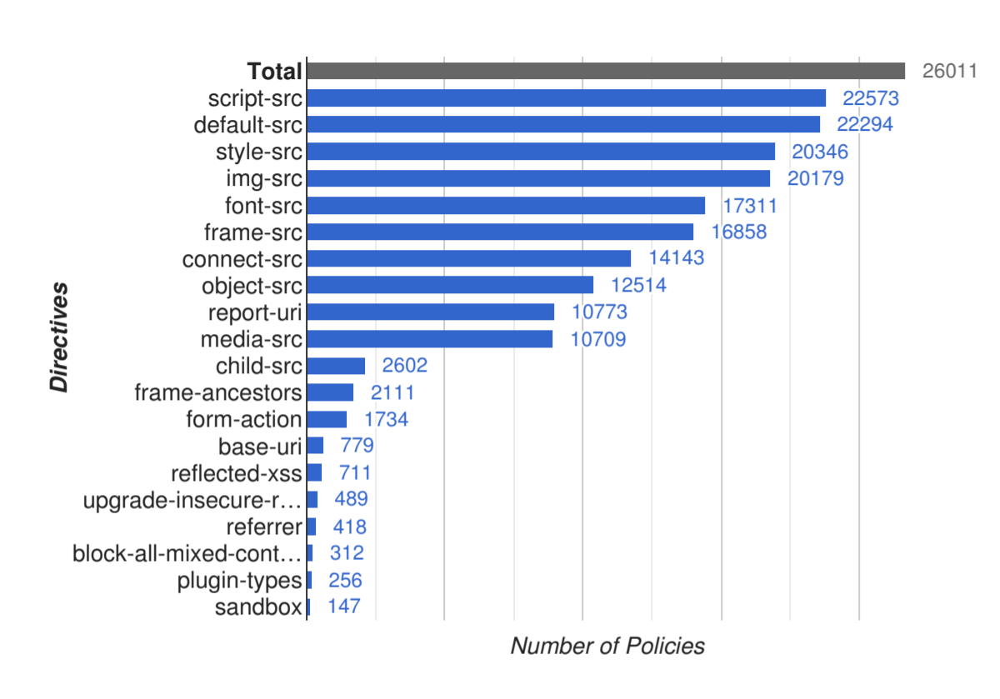
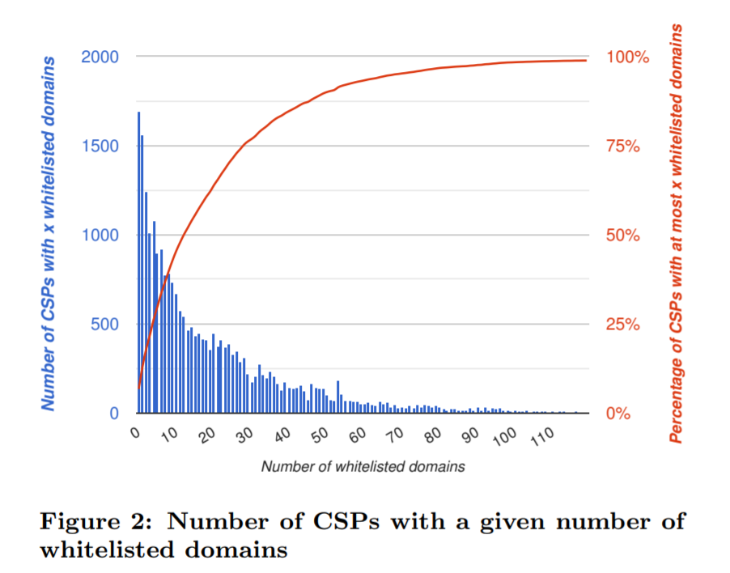
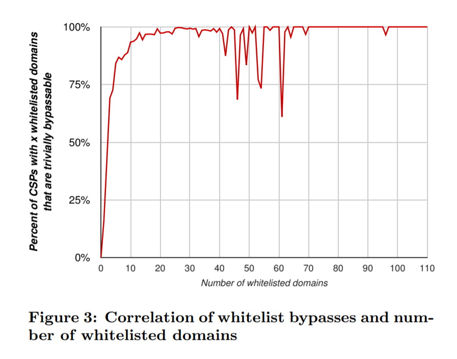
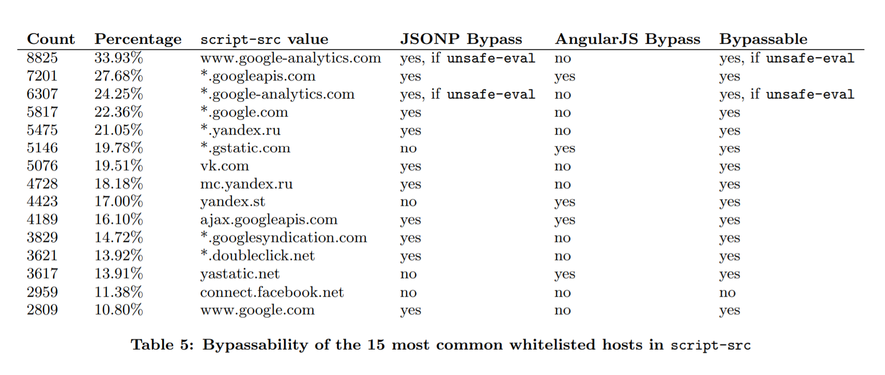
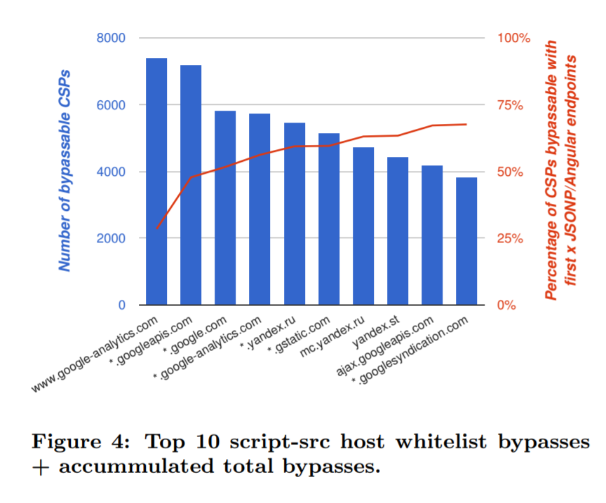

## [CSP 已死， CSP永生， 论白名单不安全及CSP的未来-译](https://storage.googleapis.com/pub-tools-public-publication-data/pdf/45542.pdf)

    CSP Is Dead, Long Live CSP! On the Insecurity of Whitelists and the Future of Content Security Policy
    - Lukas Weichselbaum  Google Inc. lwe@google.com
    - Michele Spagnuolo Google Inc. mikispag@google.com
    - Artur Janc Google Inc. aaj@google.com
    - Sebastian Lekies Google Inc. slekies@google.com

## 摘要

 
CSP(内容安全策略)一种被设计用于减轻现代web应用头号安全漏洞跨站点脚本(XSS)的web平台安全机制[24]。 这篇文章仔细地查看了采用CSP的好处和识别(CSP在)现实部署中的重大缺陷， 这些缺陷(导致XSS)绕过94.72%的(安全)策略。

我们的全网分析基于搜索引擎资料库中大约来自1百万台主机的10亿张网页，结果覆盖了部署了CSP的1680867台主机名-- （这是）迄今为止(覆盖)最全面的研究。 我们引入了CSP安全相关的各个方面的规范，聚焦XSS防护， 对CSP隐患模型进行深入分析，识别三类常见的CSP绕过策略， 并说明了他们如何破坏策略的安全性。

为了理解CSP的好处， 我们采取定量分析互联网上部署的CSP策略， 发现15个最常用的加载脚本的白名单域中， 有14个存在不安全的端点， 结果75.81%的策略因使用了白名单被绕过。 总计94.68%的策略使用限制脚本执行测策略无效， 99.34%域采用CSP策略对抗XSS无效。

最后， 我们提议'strict-dynamic'关键字作为补充， 它有助于创建基于随机数加密的策略， 不依赖域白名单， 我们讨论了在复杂应用中部署随机加密策略的经验， 为改善策略的web作者提供指引。

## 关键字

    Content Security Policy; Cross-Site Scripting; Web Security;


## 1. 简介

跨站脚本- 能够向web应用注入攻击者控制的脚本 - 是最为声名狼藉的web漏洞， 自2000年CERT advisory中正式提及， 一代又一代研究者和实践者探索监测， 阻止， 削弱它的方法， 然而， XSS仍然是最普遍的安全问题并随着网络的发展不断变化。

如今，CSP[31]是针对XSS最有希望的对策之一。CSP是一种声明式策略机制，允许web应用程序开发人员定义哪些客户端资源可以由浏览器加载和执行。CSP不允许内联脚本，只允许可信域作为外部脚本的源，它旨在限制站点执行恶意客户端代码的能力。因此，即使攻击者能够发现XSS漏洞，CSP也会通过防止漏洞的利用来保证应用程序的安全性——在无受控制受信任的主机的情况下，攻击者不能够加载恶意代码

在本文中，我们介绍了全网第一次深入分析跨web CSP部署安全性的结果。我们首先通过审查CSP的威胁模型、分析可能的配置缺陷和列举不为人知的允许攻击者绕过其保护的技术来研究CSP的保护能力

我们接着使用从谷歌搜索索引中提取的真实世界的 CSP策略进行大规模的实证研究。基于这个数据集，我们发现目前至少有1680,000台Internet主机部署CSP策略。在对我们的数据集进行规范化和去重后，我们识别出26011个不同的CSP策略，其中94.72%是可绕过的，攻击者可以自动找到破坏CSP保护的端点。虽然多数情况下，部署CSP花费了相当大的精力，但当前(CSP)策略的90.63%的包含允许内联脚本或加载任意外部站点脚本的配置让CSP形同虚设。只有9.37%的策略使用严格配置抵抗XSS，很不幸， 51.05%的严格策略仍然是可以绕过的，这是由于`script-src`白名单中存在细微的策略错误配置或不安全端点源。

基于研究结果，我们认为为一个复杂的应用程序维护一个安全白名单在实践中是不可行的;因此，我们建议通过用基于随机数和hashes[3]的方法替换脚本替换指定URL whitelists，该方法已经进入CSP规范，主要的浏览器已经在使用。

在基于随机数的策略中，应用程序定义了一个单用途的、不可猜测的令牌(nonce)，令牌在CSP策略中传递，成为为合法的应用程序控制的脚本的HTML属性。用户代理只允许执行nonce匹配策略中指定哈希的脚本; 将标记注入漏洞页面的攻击者因不知道nonce值，无法执行恶意脚本。为了简化这种基于nonce的方法的使用流程，我们为`script-src`提供了一个新的CSP源表达式，暂时称为`strict-dynamic`。使用`strict-dynamic`，动态生成的脚本会隐式地从创建它们的可信脚本中继承nonce。通过这种方式，正在执行的合法脚本可以轻松地向DOM添加新脚本，而无需对大量应用程序进行更改, 发现XSS漏洞但不知道正确的nonce的攻击者不能滥用这个功能，因为(注入)脚本被阻止执行。

为了证明这种方法的可行性，我们提出了一个在流行的应用程序中采用基于随机数策略的真实案例研究。

我们的贡献可以总结为以下几点：

- 我们第一次介绍了CSP安全模型深入分析的结果，分析了(CSP)标准对web的保护。我们
发现了常见的策略错误配置并展示三种CSP绕过策略。

- 我们通过从谷歌搜索索引中提取策略，对实际CSP部署的好处进行了大规模的实证研究。基于大约1060亿页的语料库，其中39亿页受到CSP的保护，我们确定了26011个不同的策略。发现这些政策中至少有94.72%在缓解XSS方面因为配置不当和不安全白名单实体而无效。

- 基于我们的发现，我们建议改变CSP在实践中的部署方式:我们提倡一种基于随机数的方法，而不是使用白名单。为了进一步实现这种方法，我们提出了`strict-dynamic`，这是当前在Chromium浏览器中实现的CSP3规范的新特性。我们讨论了这种方法的好处，并给出了在流行的web应用程序中部署基于随机数和`strict-dynamic`的策略的案例。

本文其余部分的结构如下:在第2节中，我们对CSP进行了深入的介绍。因此，我们在2.1中介绍了技术基础、CSP威胁模型和在2.2和2.3中设计策略时常见的安全隐患。随后，我们在第3节中给出了实证研究的结果。为此，我们首先在3.1中概述我们的研究问题，在3.2中介绍我们的数据集，在3.4中介绍结果和分析之前，在3.3中解释我们的方法。基于本研究的结果，我们在第4节提出了一种改进CSP的方法。最后，我们在第5节介绍相关的工作，然后在第6节结束。

## 2. 内容安全策略(CSP)

### 2.1 概述

内容安全策略(Content Security Policy, CSP)是一种声明机制，允许web作者在其应用程序上指定一些安全限制，支持用户代理执行策略。

CSP被用作“一种工具，开发人员可以使用它以各种方式锁定他们的应用程序，从而降低内容注入漏洞(…)的风险。”减少应用程序执行的特权。”[3]

CSP正快速发展:目前最新规范的版本是CSP3，用户代理实现的并不均衡。例如，Chromium完全支持CSP2，并实现了CSP3的大部分草案，其中有一些(CSP3规范)，还处在实验性的运行时阶段，而Mozilla Firefox和基于webkit的浏览器最近刚刚获得了完全的CSP2支持[8]。在讨论CSP的细节时，我们不关注标准的任何特定修订，而是尝试广泛概述(规范的)应用和规范版本[31]。

CSP策略在`Content-Security-Policy`HTTP响应头或`<meta>`标签中使用。CSP的功能可分为三类:

- 资源加载限制

  CSP最著名和最常用的方面是将各种子资源加载限制到开发人员允许的一组源(即源列表)的能力。常用的指令有`script--src`、`style-src`、`img-src`和接管所有(资源)的`default-src`;表1列出了管理资源的指令的完整列表。有一种特殊情况，`script-src`和`style-src`指令有几个附加的配置选项;它们允许对脚本和样式表进行更细粒度的控制，后面将对此进行讨论。

- 基于url的辅助限制

  通过监控获取的子资源不能阻止某些类型的攻击，但同样需要一个可信源与之交互文档。一个常见的例子是`frame-ancestors`指令， 为防止clickjacking[10](攻击), 它定义了加载文档的许可源。类似地，`base-uri`和`form-action`定义了哪些url可以作为`<target #href> 以及 <form #action>`的目标，以防止某些`post-xss`攻击[38]

- 各种限制和强化选项

  由于web应用程序中缺乏其他通用机制启用安全限制，CSP已经成为几个松散安全特性的安寄所。这包括`block-all-mixed-content`和`upgrade-insecure-requests` 关键字，它可以防止混合内容bug和改进HTTPS支持;`plugin-types`，限制插件格式;`sandbox`，它反映了HTML5沙箱框架的安全特性。

`表一：`

|Directive|Controlled Resource type|
|---|---|
|default-src|所有资源(降级)|
|script-src|脚本|
|style-src|样式表|
|img-src|图片|
|media-src|媒体资源(audio, video)|
|font-src|字体|
|frame-src|文档(frames)|
|object-src|插件格式(object, embed)|
|child-src|文档(frames), [shared]workers|
|worder-src|[shared]workers|
|manifext-src|Manifest|

为了使web应用程序与CSP策略兼容，web作者常常需要重构应用程序逻辑以及框架和模板系统生成的HTML。特别是要尽量避免内联脚本、eval和等效结构、内联事件处理程序和`javascript:uri`, 或使用对CSP友好的替代方法进行重构。

除了执行策略限制的默认行为之外，还可以在`report-only`模式中配置CSP，在这种模式中，攻击行为会被记录下来，但(防护策略)不会被执行。在执行和报告两种模式下，`report-uri`指令可以用来发送攻击报告，通知应用程序的所有者不兼容的标记。

`listing 1: 传统CSP策略样本`

```
Content-Security-Policy: script-src ’self’; style-src
cdn.example.org third-party.org; child-src https:
```

#### 2.1.1 资源表(source lists)

CSP源列表(通常称为白名单)一直是CSP的核心部分，指定信任关系。例如，如清单1所示，应用程序可能只信任其承载域来加载脚本，但允许使用来自`cdn.example.org`和`third party.org`的字体或图像，并要求通过HTTPS加载框架，同时不限制其他资源类型。

对于任何指令，白名单可以由主机名(`example.org`, `example.com`)组成，可能包括*通配符，扩展对所有子域的信任(`*.example.org`);方案(`https:data:`);以及表示当前文档来源的特殊关键字`self`和`none`，执行空源列表并禁止加载任何资源.

从CSP2开始，作者还可以在他们的白名单中指定路径(`example.org/resources/js/`)。有趣的是，不能依赖基于路径的限制(策略)来限制资源的加载来源;关于这个问题的更广泛的讨论载于第2.3.4节。

#### 2.1.2 脚本执行限制

由于脚本在现代web应用程序中的重要性，`script-src`指令提供了几个关键字，以允许对脚本执行进行更细粒度的控制:

|Directive|Controlled Resource type|
|---|---|
|unsafe-inline|允许内联`script`脚本块和javascript事件句柄(可以取消CSP对XSS的保护)执行|
|unsafe-eval|允许使用javascript API, 把数据当成代码执行， 比如`eval()`， `setTimeout()`， `setInterval()` 和 `Function` 构造函数， 这些API被`script-src`指令阻塞|
|CSP nonce|允许策略指定作为脚本授权令牌的一次性值(`script-src`, `nonce-random-value`)。页面上任何带有正确`nonce=“random-value”`属性的脚本都可以执行。|
|CSP hash|允许开发人员在页面中列出预期脚本的密码散列(`script-src`, `sha256-nGA…`)。任何内联脚本，其摘要与策略中提供的值相匹配，将被允许执行。|

类似地，随机数(Nonce)和散列可以与`style-src`指令一起使用，允许通过随机值加载内联样式表和白名单内外部CSS。

`Listing 2: 使用随机数和hash值锁定策略`

```
Content-Security-Policy: script-src ’nonce-BPNLMA4’
’sha256-OPc+f+ieuYDM...’ object-src ’none’;
```
### 2.2 CSP威胁模型

CSP要想提供安全防护，它必须防止攻击者利用漏洞对应用程序的用户进行恶意操作。就目前来看，CSP对三种类型漏洞提供防护。

- XSS

  在有漏洞应用程序中注入和执行不受信任的脚本(受`script-src`和`object-src`指令保护)

- Clickjacking(点击劫持)

  通过在攻击者控制的页面上覆盖隐藏的帧，迫使用户在受攻击的应用程序中执行非期望的操作(通过限制`frame-ancestors`来保护)

- Mixed content
 
  意外地将资源从不安全的协议中加载到通过HTTPS交付的页面上(通过使用`upgrade-insecure-requests`和`block-all-mixed-content`关键字， 并将脚本和敏感资源的加载限制为HTTPS)。

因此，只有一小部分CSP指令对XSS保护有用。2.2.2节进一步讨论在应用程序上下文中执行恶意脚本攻击的所有保护指令。

#### 2.2.1 采用CSP的好处

由于一些流行的用户代理还不支持CSP或只提供部分支持[8]，所以在主安全机制失败的情况下，CSP只能作为一种纵深防御来阻止攻击。因此，使用CSP的应用程序也必须采用传统的保护机制;例如，使用具有严格上下文转义的框架来生成标记，使用`X-Frame-Options`头来防止点击劫持，并确保通过HTTPS获取安全页面上的资源。

设置内容安全策略的实际好处只有在主安全机制不足的情况下——当开发人员引入编程错误(导致XSS、单击劫持或混合内容错误)时，CSP可以帮助保护用户。

然而，在实践中，使用`X-Frame-Options`进行的点击保护很少被破坏，并且在现代用户代理中，活动混合内容(`mixed content`)(脚本和从HTTPS web页面通过HTTP加载的其他活动内容)在默认情况下已经被阻塞。因此，CSP的主要价值——构建标准[3]的主要目的——在于防止对XSS的利用，这是惟一一种可以被CSP缓解，并且通常是开发人员无意中引入的的漏洞。

#### 2.2.2 防范XSS

CSP的安全优势主要集中在防止脚本执行的两个指令:`scripts-rc`和`object-src`(像Adobe Flash这样的插件可以在嵌入页面的上下文中执行JavaScript)，或者在没有脚本的情况下执行`default-src`

攻击者注入和执行脚本可以绕过所有其他指令的限制。因此，使用不安全`script-src`和`object-src`源列表策略的应用程序从CSP中获得的好处非常有限。对于其他指令想要提供安全保护，站点必须首先使用安全策略防止脚本执行。一般来说，非脚本指令可以防御某些`post-XSS`[38]或`scriptless`[13]攻击，比如通过劫持表单uri来提取数据，或者通过使用攻击者控制的样式来欺骗页面UI达成钓鱼攻击，但只有在CSP对XSS的保护有效时，它们才能提升安全。

想要阻止非法脚本执行， 策略必须满足三个要求：

- 策略必须同时定义`script-src`和`object-src`指令(或者提供`default-src`)

```
  <script src="//evil.com"></script>
  <object data="//evil.com/evil.swf">
    <param name="allowscriptaccess" value="always">
  </object>
  // Listing 3: CSP 因没有指令被绕过
```

- `script-src`源列表不能包含`unsafe-inline`(不安全内联)关键字(除非附带一个nonce)或允许数据:URIs

```

<script src="data:text/javascript,evil()"></script>
// Listing 4: 不安全内联关键字和data:uris 被绕过
```

- `script-src`和`object-src`源列表不能包含任何允许攻击者控制响应的安全相关部分或包含不安全库的端点。

```
<script src="/api/jsonp?callback=evil"></script>
<script src="angular.js"></script> <div ng-app>
{{ executeEvilCodeInUnsafeSandbox() }} </div>
// Listing 5: XSS CSP 白名单绕过
```

如果没有满足这些条件，则该策略在防止脚本执行方面无效，因此无法躲避内容注入攻击。

现在我们转向对端点类型的分析，这些端点在白名单合法源上， 允许攻击者绕过CSP执行脚本。

### 2.3 脚本执行绕过

CSP的一个基本假设是，策略中白名单的域只提供安全内容。因此，攻击者应该不能在白名单源的响应中注入有效的JavaScript。

在下面的小节中，我们将说明，在实践中，现代web应用程序使用的攻击此假设的几种模式。

#### 2.3.1 附带用户控制回调(函数)的javascript

虽然许多JavaScript资源是静态的，但在某些情况下，开发人员可能希望动态地生成脚本的一部分，方法是允许请求参数在加载脚本时设置要执行的函数。例如，将JavaScript对象包装在回调函数中的JSONP接口通常用于加载API数据，方法是将其作为来自第三方域的脚本提供:

```
<script
src="/path/jsonp?callback=alert(document.domain)//">
</script>
/* API response */
alert(document.domain);//{"var": "data", ...});
// Listing 6: 加载 JSONP 数据
```
不幸的是，如果策略中的域包含一个JSONP接口，攻击者可以使用它在漏洞页面的上下文中执行任意的JavaScript函数，方法是使用攻击者控制的[39]将端点加载为`<script>`附带一个攻击者控制的回调函数， 如果攻击者能够从起始控制JSONP响应的，他们将无限制地执行脚本。如果字符集是受限的，只有函数名是可控的，那么它们可以使用一些技术，比如SOME[12]，通常实质上等同于完全的、无约束的XSS。

#### 2.3.2 反射或字节码执行(symbolic execution)

CSP限制脚本执行可以(经常是意外地)通过一个白名单源里的协同脚本绕过。例如，一个脚本可以使用反射来查找和调用全局范围内的函数，如Listing 7图所示。

```
// Can be used to invoke window.* functions with
// arbitrary arguments via markup such as:
// <input id="cmd" value="alert,safe string">
var array =
document.getElementById(’cmd’).value.split(’,’);
window[array[0]].apply(this, array.slice(1));

//JavaScript反射小工具
```

这样的JavaScript小工具通常不会危害安全性，因为它们的参数是由页面加载脚本的开发人员控制的。当这些脚本通过检查DOM获取数据时，会出现问题，如果应用程序存在标记-注入错误，那么DOM可以部分受攻击者控制——攻击者可以附带无约束的参数执行任意函数，绕过CSP。

一个实际的例子是流行的AngularJS库的行为，它允许使用模板语法和客户端模板求值创建单页应用程序(清单8)。

```
<script src="whitelisted.com/angular.js"></script>
<div ng-app>{{ 1000 - 1 }}</div>
//Listing 8: 加载angularjs 绕过 CSP
```

为了实现模板语法，AngularJS在页面的指定部分解析模板并执行它们。AngularJS解析模板的能力等同于执行任意的JavaScript。默认情况下，AngularJS使用eval()函数来求解沙箱表达式，CSP策略禁止使用`unsafe-eval`关键字。不过，AngularJS也附带了一个`CSP兼容模式`(`ng-csp`)，在该模式中，表达式通过执行字节码进行求值，这样就可以忽略CSP， 调用任意的JavaScript代码。

因此，攻击者可以从CSP的白名单域加载AngularJS库(借助AngularJS模板语法)用作JS小部件绕过脚本执行保护。即使被攻击的应用程序没有使用AngularJS，也是可以(绕过的)——唯一的要求是AngularJS库驻留在`script-src`中白名单一个域上。因此，可信域中存在任何AngularJS库都可以破坏CSP提供的保护。

#### 2.3.3 意外javascript解析响应(unexpected javascript-parseable responses)

由于兼容性的原因，web浏览器在检查响应的MIME类型是否与使用响应的页面上下文匹配时通常比较宽容。任何可以被解析为没有语法错误的JavaScript的响应——以及在第一个运行时错误之前出现的攻击者控制的数据——可以引起脚本执行。因此，下类型的响应可以绕过CSP:

- 附带部分攻击者控制内容的逗号分割值(Comma-separated value)(CSV)

```
Name,Value
alert(1),234
```

- 输出请求参数的错误信息

```
Error: alert(1)// not found.
```

- 用户文件上传, 即便内容充分HTML转义或者清洗

因此，如果一个白名单域托管具有这些属性的任何端点，攻击者可以“伪造”脚本响应并执行任意的JavaScript。类似的问题也适用于`object-src`白名单:如果攻击者向一个`script-src`白名单域上传的资源被解释为Flash对象，脚本就有可能被执行。

需要注意的是，上面的任何绕过模式都不会带来直接的安全风险，因此开发人员通常没有理由更改它们。但是，当应用程序采用CSP时，这些端点因允许策略被绕过而带来安全问题。

有问题的是，这个问题不仅影响应用程序的源，还影响到`script-src`白名单中所有其他域。这些域通常包括信任的第三方和可能不知道CSP的CDNs——因此必须识别和修复允许CSP绕过的行为。

#### 2.3.4 路径限制安全机制

为了解决基于域的源列表粒度不足的问题，CSP2引入了将白名单限制到给定域上特定路径的能力(例如`example.org/foo/bar`)。开发人员现在可以选择指定受信任域上的特定目录，以便加载脚本和其他资源。

不幸的是，由于涉及到处理跨源重定向[15]的隐私问题，这一限制已被放宽。如果源列表条目包含重定向端点(返回指向另一个位置的30x响应的端点)，重定向端点可以成功地从白名单源加载资源，即使它们与策略中允许的路径不匹配。

```
Content-Security-Policy: script-src example.org
partially-trusted.org/foo/bar.js
// Allows loading of untrusted resources via:
<script src="//example.org?
redirect=partially-trusted.org/evil/script.js">
//Listing 9: 重定向绕过CSP PATH
```

由于这种行为以及在复杂web应用程序中重定向的流行(通常用于OAuth等安全上下文中并防止引用泄漏)，不能依赖CSP中的路径限制的安全机制。

我们已经展示了一些看似良性的编程模式如何允许内容注入攻击者绕过CSP提供的脚本执行保护，(这些模式)抵消了的防护XSS的好处。现在我们来分析绕过真实策略带来的影响。

## 3. CSP实证研究

为调查CSP的普及和在实践中提供和保护能力， 我们进行了一项大规模的实证研究，以收集和分析实际的CSP政策。这一部分，我们描述了研究的方法和结果

### 3.1 研究问题

研究分为两个主要部分。首先，了解CSP目前是如何使用的;其次，要分析已部署策略的安全性属性

#### 3.1.1 CSP如何在网络上使用

正如先前的研究[36,27]所显示的，CSP的使用率落后于安全社区的预期。本研究的第一部分的目标是阐明CSP的当前状态，了解CSP的使用范围。我们还想了解CSP是否只用于XSS保护，或者是否存在其他流行的用例。由于许多主要的web应用程序需要更改为才能兼容CSP，所以目前还不清楚在原生(wild)环境中的CSP策略是否已经用于XSS保护，或者处于一种相当实验性的状态，在这种状态下，CSP策略执行仍然是禁用的。我们感兴趣的是执行模式下的政策与报告模式下的政策之间的比率。在本研究的第二部分中，将使用执行策略进行安全分析。

#### 3.1.2 真实世界中CSP策略是否安全

如第2节所述，有许多缺陷可能使策略的保护功能无效。制定策略时避免这些错误需要广泛的知识。在研究的第二部分，我们的目标是确定有多少策略会受到错误的影响进而被绕过。我们还调查了哪些类型的错误是最普遍的。

此外，我们的目标是分析严格策略的安全性，特别是白名单的安全性。

### 3.2 数据集(Data Set)

为了回答上面提出的问题，我们使用了一个代表整个web的数据集:一个包含大约6.5 pb的数据的搜索索引。该索引包含在过去20天内通过谷歌搜索爬虫设施在公共互联网上爬行的(页面)响应头和页面body。

### 3.3 (研究)方法

在下面的小节中，将概述从给定数据集中提取和分析内容安全策略的方法。

#### 3.3.1 探测CSP

为了从数据集中提取CSP策略，我们编写了一个MapReduce作业。对于使用CSP策略的索引中的每个URL，提取了以下元组:

  (URL, CSP, isCSP ReportOnly)

基于这个元组列表，通过有效去重后为每个主机提取了一组惟一的策略。

#### 3.3.2 规范CSP策略(Normalizing CSP policies)

一些网站自动生成CSP策略，其中包括随机的nonces、散列或报告uri。在这个过程中，一些生成例程随机地改变某些指令或指令值的顺序。为了使数据集中的策略具有可比性，首先将策略规范化。我们实现了规范1中描述的CSP解析器，并存储了每个CSP的解析副本，以便以后进行深入的计算。对于每个策略，应用了以下规范化流程:

- 首先，我们删除了多余的空格，并用固定的占位符替换所有变量值，如nonces和report uri

- 其次，我们对所有的指令和指令值进行了排序和去重。

#### 3.3.3 CSP去重

在分析中，注意到消息板和电子商务平台等现成的web应用程序分布在许多不同的主机上，同时部署完全相同的CSP策略。为了解决这个问题，我们决定在规范化策略字符串的基础上对CSP进行去重， 最终数据集为我们在网上发现的每一个唯一的策略提供唯一的入口(key值)

#### 3.3.4 识别XSS-防护策略

正如前面所描述的，CSP支持许多主要功能不是用于防御XSS的指令，比如`img-src`和`frame-ancestors`。由于我们的研究旨在根据策略的XSS缓解能力来评估其安全性，因此我们需要一种方法来区分那些能够抵御XSS的策略和其他策略。根据我们的定义，一个xss保护策略必须处于执行模式，并且必须包含以下两个指令中的至少一个:`script-src`或`default-src`。

#### 3.3.5 评估策略的安全性

为了评估CSP策略是否可以被绕过执行攻击控制脚本，我们进行以下检查:

- 1 使用`unsafe-inline`

  如果策略中没有指定脚本nonce，那么带有`unsafe-inline`关键字的策略本质上就是不安全的。这样的政策标记为`bypassable`。

- 2 缺少`object-src`

  一个指定`script-src`但缺少`object-src`指令(不设置`default-src`)的策略允许通过注入插件资源来执行脚本，如List 3所示。

- 3 在白名单中使用通配符

  如果与安全相关的白名单包含通配符或允许包含来自任意主机的内容的URI模式[2]，则策略也不安全。

- 4 白名单中不安全的源

  当包含有CSP绕过的端点的域被白名纳入时，CSP的保护能力就会无效，2.3节对此已讨论。为了评估策略的安全性，我们使用这种可通过的端点编译了一个主机列表。如果给定策略的白名单条目出现在此列表中，我们将该策略标记为`bypassable`。在下一节中，我们将概述如何创建这个列表。

3.3.6 识别包含CSP绕过端点的域

为了识别CSP中不安全的白名单域，我们从搜索索引中提取了使用第2.2节中描述的实践之一的页面。如前所述，托管AngularJS库和公开JSONP端点是创建CSP绕过的两种方法。

- JSONP端点

  为了识别JSONP端点，我们从搜索索引中提取了包含GET参数的所有url，该参数具有以下名称之一:回调`(callback)、cb、json、JSONP`。随后，我们通过更改相应参数的值、请求资源, 检查更改后的值是否在响应开始时显示， 验证结果数据集。通过验证响应中允许的字符来检查所有端点是否允许全`XSS`或`SOME`攻击。根据我们的数据，39%的JSONP绕过允许任意的JS执行，而其余的通过`SOME`攻击允许对现有函数的任意调用，在真实世界中，这种攻击与完全的XSS[12]一样有害。


  

Figure 1: Distribution of CSP directives among unique CSPs

- AngularJS

  对于AngularJS库，我们创建了一个小签名，该签名匹配源代码的特定部分(即压缩过的的和未压缩的)。对于每个匹配，我们通过匹配包含的版本字符串提取文件的版本。


### 3.4 结果与分析

#### 3.4.1 网络上CSP状况

我们使用谷歌的一个指标作为检测CSP政策的数据集。在分析的时候，这个索引包含了大约1060亿个唯一的url，跨越了10亿个主机名和1.75亿个顶级私有域。我们认为这个索引代表了web的当前状态，因为在分析之前，谷歌爬虫在大约20天的时间内访问了所有的url。

在这个数据集中，我们发现3,913,578,446(3.7%)的url带有CSP策略。然而,由于占据大量url的应用程序在整个数据集过高的比例， 这并不是一个理想的近似CSP采用率的数字。当考虑跨域的分布,整个画面看起来有点不一样:274214个顶级私人领域下只有1664019(0.16%)的主机名部署一个CSP政策。在这个列表中，有100万个主机名被映射到5个电子商务应用程序中的一个，只使用了一些不同的策略。为此，使用规范化策略对数据集进行了去重。据此，确定了26011个不同的策略。

#### 3.4.2 CSP如何被使用的

CSP的主要目标是防止XSS攻击。然而，它有许多其他的用例。因此，第一步，我们试图确定CSP是否用于其预期目的。图1显示了所有CSP指令的列表，按出现次数排序。清单清楚地显示，大多数策略都使用了`script-src`和/或`default-src`指令。相比之下，可以用于控制页面框架行为的`frame-ancestors`指令只在8.1%的策略中使用。此外，在26011个不同的策略中，只有9.96%处于报告模式，而其他的90.04 %处于执行模式。在这些数字中，我们看到了明显的证据，表明CSP是用于XSS保护。

#### 3.4.2 安全分析： 概述

我们分析的目标是找出CSP的当前形式是否可以有效地保护XSS缺陷。为此，我们编制了三个不同的数据集:

- 1 全策略

  该数据集包含所有不同的CSP策略，包括报告和执行模式。

- 2 XSS保护策略 

  此数据集包含所有执行策略，其中至少包含一个针对XSS(`script-src`、`object-src`或`default-src`)的指令。此数据集排除了`non-xss-protection`用例的所有策略。

- 3 严格的xss保护策略

  最后，我们在整个数据集中编译了一组最强的CSP策略。这些策略不包含任何内在不安全的指令值， 比如`unsafe-inline`, URI模式或允许所有白名单端点通配符*。

表2给出了最终结果。每个数据集的结果显示在表的一行中。在下面的小节中，我们将详细讨论这些结果。 


#### 3.4.4 CSP的一般安全性

为了评估检测到的CSP策略的安全性属性，我们自动应用了2.2节中描述的检查。通过对配置和白名单可绕过性的分析，我们发现总体数据集中有94.72%的策略对XSS没有提供任何保护。需要注意的是，其中一些策略不是执行模式，或者不是用于保护XSS;然而，即使是xss保护策略，策略可绕过的百分比也非常相似:94.68%。

不幸的是，大多数策略本质上是不安全的。在XSS保护策略中，有87.63%使用了`unsafe-inline`关键字，但没有指定一个`nonce`，这实际上禁用了CSP的保护功能。这个惊人的数字可能是由于许多web应用程序需要重写大部分代码兼容CSP。其中一些页面可能仍处于过渡阶段，需要使用`unsafe-inline`关键字。虽然这个问题可能会在长期内得到解决，但是许多策略包含了其他明显的问题。例如，我们确定9.4%的策略既不包含`default-src`，也不包含`object-src`指令。因此，攻击者可以通过注入能够执行JavaScript的恶意Flash对象来利用XSS漏洞。此外，21.48%的策略在`script-src`或`default-src`指令中使用通用通配符或URI模式(http:或https:)，允许引入来自任意、潜在攻击者控制的主机上的脚本。

考虑到这些数字，似乎绝大多数的策略都不能有效地保护XSS漏洞。然而，由于CSP可能不成熟，早期的采用问题可能会使这个数字膨胀。为了说明这一现状，我们编译了一组不包含繁琐问题的策略，如`unsafe-inline`关键字或白名单中的一般通配符。总的来说，我们发现了2437项符合这些标准的策略。我们发现，通过我们的自动政策分析工具，我们仍然能够绕过这些严格政策的51.05%。虽然有些绕过是由于缺少`object-src`和`default-src`指令引起的，但是大部分的绕过是由于`script-src`白名单中不安全的源引起的。在下一节中，我们将详细讨论我们对白名单的分析。

#### 3.4.5 白名单的安全

对于白名单中的每个主机，维护者需要确保攻击者不能注入恶意内容，恶意内容如2.3.1部分描述通过`<script>`或者`<object>`标签引入， JSONP端点和AngularJS库是实现它的两种方法。如果只有一个域公开这样的端点，那么CSP的反xss功能就变得毫无用处。因此，白名单越大，维护相应策略的安全性就越困难。

  

图2描述了具有特定数量的白名单域的CSP策略的数量。在中间值，策略有12个不同的白名单主机。此外，还有一长串包含大量条目的策略。例如，白名单最长的策略包含512个主机。


通过查询索引，我们找到了19,908个包含JSONP端点的域，以及托管AngularJS库的101,330个域。对于数据集中的每个策略，我们然后检查这个列表中是否包含一个白名单域。通过这种完全自动化的方法，我们发现41.65%的严格策略和79.17%的所有xss保护策略都有不安全的白名单(见表4)。数字非常高， 这还是保守计算， 由于许多CSP绕过是依赖于应用程序的，所以很难完全自动化发现过程。因此，我们认为，不安全政策的实际数字甚至更高。



图3显示在实践中维护长白名单是不可行的。该图显示了绕过如何与白名单的长度相关。短的白名单仍然很安全，较长的白名单则不那么安全。例如，中位数有12个条目，而我们绕过了中位数94.8%的策略。



表5列出了按出现次数排序的15个白名单主机条目。结果清楚地表明，维持白名单是困难的。在前15个领域中，12个引入了完整的CSP绕过，2个如果加上`unsafe-eval`也可以绕过，并且只有1个不能自动绕过。



图4展示了白名的前10个域足以绕过68%的所有不同的csp。即使JSONP和AngularJS端点从前10个域中删除，主机66%的观察策略仍然可以绕过。

我们的分析结果表明，在传统的基于白名单的模型中部署CSP来防止XSS是不可行的，因为在实践中脚本执行限制通常可以被破坏。在第4节中，我们提出了一种解决这个问题的方法，即使用脚本nonces替换域白名单的CSP策略。

## 改善CSP

实际上，目前大多数网站都部署了的CSP针对XSS的无用。除了明显的配置问题(带有`unsafe-inline`的策略和不指定`object-src`的策略)之外，策略不安全的主要原因是`script-src`白名单的可绕过性。在现代web中，基于白名单域(即使附带路径)的方法似乎太不灵活，不能为开发人员提供安全收益和防止XSS。

与此同时，CSP已经提供了更细粒度的方法来授予脚本信任:密码学nonces和散列。特别是，nonces允许开发人员显式地注释每个受信任的脚本(包括内联脚本和外部脚本)，并阻止攻击注入脚本的执行。

为了提高csp原生整体安全性，我们提出了一种稍微不同的策略编写方法。应用程序维护人员应该采用非基于随机数的保护方法，而不是依赖于白名单。下面的列表描述了基于白人的CSP策略和满足该策略的脚本:

```
Content-Security-Policy: script-src example.org
<script src="//example.org/script.js?callback=foo">
</script>
```

不幸的是，这个策略的白名单包含一个不安全的主机，因此描述的策略是不安全的。攻击者可以通过注入具有以下URL的脚本来滥用JSONP端点:`https://example.org/script?callback= malicious_code`

为了避免这一问题，我们建议以以下方式改写此类策略:

```
Content-Security-Policy:
script-src ’nonce-random123’
default-src ’none’
<script nonce="random123"
src="https://example.org/script.js?callback=foo">
</script>
```

通过使用nonce，脚本可以单独入白名单。即使攻击者能够找到XSS, nonce值也无法预测，因此攻击者不可能指向JSONP端点的注入有效脚本。

CSP的一个有用特性是，它允许集中执行安全决策。例如，安全团队可能会使用CSP来强制执行一组可加载脚本的受信任主机，而不是依赖于开发人员的善意来不包含来自不受信任站点的脚本。然而，在单一的非基于随机的策略中，这是不可能的;资源只需要遵循白名单或nonce。因此，在非基于nonce的策略中添加白名单将消除nonce的好处。有趣的是，浏览器允许执行多种策略。如果为页面指定了两个策略，浏览器将确保资源同时遵循这两个策略。因此，可以使用这个特性来获得这两个方面的好处:可以使用一个基于nonce的策略来对单个脚本进行白名单，而使用第二个基于白名单的策略来集中执行安全决策。通过使用逗号分隔两个策略，可以在同一个HTTP响应头中将它们传输到客户机:

```
Content-Security-Policy:
<!-- whitelist - based CSP -->
script-src https://example.org
default-src https://foobar.org,
<!-- nonce - based CSP -->
script-src ’nonce-random123’
```

nonce-based策略的另一个问题出现,当新的脚本通过JavaScript添加到页面的:因为JS库可能不知道CSP和不知道正确的CSP nonce,动态地插入脚本将被CSP阻止执行,部分应用程序会失败。

为了解决这个问题，并在不依赖源列表的情况下促进安全策略，我们为脚本-src提出了一个新的`script-src`：`strict-dynamic`, `strict-dynamic`是CSP3规范草案，并在Chrome和Opera中实现。我们在4.2中描述了在一个流行的生产应用程序采用的过程和结果。

### 4.1 向动态脚本传递信任

在`script-src`源列表中添加建议的`strict-dynamic`关键字有以下后果:

- 允许动态添加执行脚本。在实践中，这意味着`document.createElement('script')`创建的脚本节点将被策略所允许，而不管它们所装载的URL是否在`script-src`白名单中。

- 其他`script-src`白名单条目被忽略。除非有有效的nonce，否则浏览器将不会执行一个静态或插入的脚本。

这种方法背后的核心观察是，通过调用`createElement()`添加的脚本已经被应用程序信任——开发人员已经显式地选择加载和执行它们。另一方面，如果攻击者发现了`markup-injection bug`，那么在没有执行JavaScript之前就不能直接调用createElement();攻击者不知道策略中定义的正确的nonce，就不能注入恶意脚本并执行JavaScript。

这种使用CSP的模式提供了启用基于nonce策略的承诺，在这种策略中，执行脚本的能力由开发人员通过在受信任的脚本上设置nonces来控制，并通过设置`strict-dynamic`来允许信任传播到下标(subscript)。

例如，开发人员可以设置类似如下的策略:

```
Content-Security-Policy:
script-src ’nonce-random123’ ’strict-dynamic’;
object-src ’none’;
```

使用这样的策略，所有者需要向静态元素添`<script>`加nonces，但必须确保只有这些受信任的脚本及其后代将执行。这种部署CSP的模式可以显著提高策略的安全性且方便采用。

### 4.2 `strict-dynamic` 案例研究

2015年2月，我们在谷歌Maps活动中采用了基于白名单的执行内容安全策略，这是一个复杂的、大量使用javascript的web应用程序，每月有400万活跃用户使用。我们从一个简单的策略开始，包括一个nonce和一个完整的源，但是必须逐步扩展它——在整个2015年进行5个主要的更改——以处理应用程序、api和库中的更改，同时尽可能保持白名单路径的安全性和限制性。为了避免生产中出现故障，我们必须定期更新起源，以反映对API和内容服务基础设施的更改。这导致了`script-src`白名单的爆炸式增长:它增长到15个长路径，不幸的是，它仍然必须包含至少一个JSONP端点，这损害了策略在XSS保护方面的有效性。

由于标记中的脚本都已经存在，所以从基于whitelist的方法转换到具有`strict-dynamic`的`nonce-only`策略，不需要进行重构。这一转变也使我们能够极大地简化政策，避免故障，同时使其更安全，更容易维护——事实上，从那时起，我们一直未对政策做出改变。

到目前为止，我们在谷歌的照片、云控制台、历史、文化研究所等方面花费很小的功夫部署`nonce-only`附加`strict-only`策略。

### 4.3 局限

使用`strict-dynamic`的`nonce-based`策略提供了一个更安全、更容易部署的CSP的承诺，但它们不是完全解决了XSS。作者仍然需要关注安全性和兼容性:

#### 4.3.1 安全

- 注入动态创建脚本的src属性:

  如果XSS漏洞的根本原因是不可信的数据通过`createElement() API` 创建`<script>`, 并通过src属性注入到一个URL,该错误将被利用,而whitelist-based政策,使用`strict-dynamic`结合白名单,脚本的源被限定为策略允许(源)。

- 注入带nonce的`<script>`标签：
 
  如果诸如点在被开发者信任的带nonce的`<script>`中， 攻击者能够无限制执行恶意脚本， 传统策略依然有效

- Post-XSS/scriptless攻击：

  即使策略阻止攻击者在应用程序上下文中执行任意脚本，也可能存在其他限制，但也可能造成破坏性攻击

4.3.2 兼容性

- 插入的解析脚本(Parser-inserted scripts)
  
  如果一个应用程序使用诸如`document.write()`这样的api来动态添加脚本，即使它们指向一个白名单内源，也会被`strict-dynamic`阻塞。采用者必须重构这些代码以使用另一个API，如createElement()，或者显式地将一个nonce传递给使用document.write()创建的`<script>`

- 内联事件句柄

  `strict-dynamic`并不能消除删除与CSP不兼容的标记的耗时过程，比如`javascript: uri`或内联事件处理句柄。在采用CSP之前，开发人员仍然需要重构这些模式。

基于对google内部数据集中的数百个XSS错误的分析，尽管有这些注意事项，我们预计大多数XSS将通过使用`nonce-based`策略得到缓解，并且对于开发人员来说，采用这种策略要比传统的基于whitelists的方法容易得多。

## 相关工作

在2007年[16]发表了最早的一篇论文，该论文提出脚本白名单阻止注入攻击。该系统称为浏览器强制嵌入策略(BEEP)，旨在根据应用程序所有者提供的策略在浏览器级别限制脚本引入。与BEEP类似，Oda等人提出了SOMA[26]，它将BEEP的概念从脚本扩展到其他web资源。Stamm等人采纳了这些想法，他们发表了最初的CSP论文`《Reining in the Web with Content Security Policy》`[31]。之后，几个浏览器供应商和标准化委员会采用了CSP。2011年，Firefox[32]和Chromium[2]推出了第一个实验原型。随后，CSP的几个迭代被标准化并交付。

最初，CSP得到了很多关注，许多网站开始尝试它。然而，由于(使用)CSP需要大规模的变动，所以采用率仍然很小。2014年，Weissbacher等人发表了关于采用CSP[36]的第一个研究。在他们的研究中，他们发现前100个网页中只有1%使用了CSP。为了探究低使用率背后的原因，他们将CSP策略部署到三个不同的站点进行了实验。因此，他们发现创建初始策略非常困难，因为安全策略需要对现有应用程序进行大量的更改。这个问题被`Doup´e et al` 发现。他们的系统,名叫`deDacota`[7],采用自动代码重写将内联脚本外部化。这进而使他们的系统能够自动地将CSP策略部署到给定的应用程序中。

Kerschbaumer等人致力于解决类似的问题。他们注意到许多页面为了避免重写它们的应用程序使用不安全的`unsafe-inline`关键字。因此，Kerschbaumer等人创建了一个系统，通过众包学习方法[19]自动生成CSP策略。随着时间的推移，他们的系统习得了多个用户观察到的合法脚本，并确保只有这些合法脚本通过脚本散列才能进入策略中的白名单。

Johns对CSP的另一个问题进行了调查。在他的论文[17]中，他讨论了由动态生成的脚本引起的安全问题。为了应对类似于jsonp的端点所带来的威胁，他建议不基于它们的源对，而是基于对脚本的散列的校验对脚本进行白名单验证； 但是，这种方法只适用于静态文件，而不适用于如JSONP这样的动态文件。因此，他提出了一个脚本模板机制，允许开发人员从静态代码中分离动态数据值。通过这种方式，可以为脚本的静态部分计算脚本的散列，也能够包含动态数据值。

Hausknecht等人的另一篇论文研究了浏览器扩展和CSP[11]之间的紧张关系。作者对Chrome web store中的浏览器扩展进行了大规模的研究，发现许多扩展会威胁页面的CSP。因此，他们提出了一种背书机制，允许扩展在更改安全策略之前请求web页面的许可。

在第4节中，我们提出了一种编写CSP策略的新方法。我们建议使用脚本nonces来代替白名单。使用nonce来预防XSS的想法以前已经提出过。第一个这样做的论文提出了一个叫做Noncespaces[9]的系统。Noncespaces会自动为合法的HTML标签加上随机的XML命名空间。如果应用程序中出现了注入漏洞，攻击者无法预测这个随机命名空间，因此无法注入有效的脚本标记.

另一个采用指令集随机化思想的系统是xJs[1]。xJS XORs为所有合法的JavaScript代码提供一个密钥，该密钥在服务器和浏览器之间共享，并为每个请求刷新。由于浏览器在运行时解密脚本，攻击者不知道密钥，因此不可能创建有效的利用载荷(payload)。

## 结论

本文在大规模实证研究的基础上，对CSP在实际应用中的实际安全效益进行了评估。

我们对CSP的安全模型进行了深入的分析，发现了几个看似安全的策略并没有提供安全改进的案例。我们调查了对超过10亿个主机名采用CSP的情况，并在谷歌搜索索引中使用160万个主机识别了26011个唯一策略。

不幸的是，这些政策中的大多数本质上都是不安全的。通过自动检查，我们能够证明94.72%的策略可以被攻击者使用带有markup-injection的bug绕过。此外，我们还分析了白名单的安全性， 我们发现所有策略的75.81%和所有严格策略的41.65%的白名单中都包含至少一个不安全的主机。这些数字使我们相信，在CSP政策中，白名单实际上没什么用。

因此，我们提出了一种新的策略书写方式。我们建议通过基于CSP nonces的方法来启用单个脚本，而不是将整个主机白名单化。

为了方便采用基于nonce的CSP，我们进一步提出了`strict-dynamic`关键字。在CSP策略中指定后，该关键字允许浏览器中的模式将nonces继承到动态脚本。因此，如果一个脚本在运行时使用nonce创建了一个新脚本，那么这个新脚本也将被认为是合法的。尽管这项技术与CSP的传统主机白名单化方法有所不同，但我们认为可用性的改进足以适应它的广泛推广。由于这是一种可选择的机制，所以默认情况下不会降低CSP的保护能力。

预计，基于nonce的方法和`strict-dynamic`关键字的结合将使开发人员和组织最终享受到内容安全策略提供的真正安全好处。

## 引用

<font color=gray size='2'>

[1] E. Athanasopoulos, V. Pappas, A. Krithinakis, S. Ligouras, E. P. Markatos, and T. Karagiannis. xjs: practical xss prevention for web application development. In USENIX conference on Web application development, 2010.

[2] A. Barth. Bug 54379 - add basic parser for content security policy, 2011.

[3] A. Barth, D. Veditz, and M. West. Content security policy level 2. W3C Working Draft, 2014.

[4] D. Bates, A. Barth, and C. Jackson. Regular expressions considered harmful in client-side xss filters. WWW ’10.

[5] H. Bojinov, E. Bursztein, and D. Boneh. Xcs: cross channel scripting and its impact on web applications. CCS ’09.

[6] CERT. Advisory ca-2000-02 malicious html tags embedded in client web requests, Feb. 2000.

[7] A. Doup´e, W. Cui, M. Jakubowski, M. Peinado, C. Kruegel, and G. Vigna. dedacota: toward preventing server-side xss via automatic code and data separation. In CCS’13.

[8] M. Foundation. Csp policy directives, 2016.

[9] M. V. Gundy and H. Chen. Noncespaces: Using randomization to enforce information flow tracking and thwart cross-site scripting attacks. In NDSS, 2009.

[10] R. Hansen and J. Grossman. Clickjacking, 2008.

[11] D. Hausknecht, J. Magazinius, and A. Sabelfeld. May i?-content security policy endorsement for browser extensions. In DIMVA’15.

[12] B. Hayak. Same origin method execution (some): Exploiting a callback for same origin policy bypass, 2014.

[13] M. Heiderich, M. Niemietz, F. Schuster, T. Holz, and J. Schwenk. Scriptless attacks: stealing the pie without touching the sill. In CCS’12.

[14] M. Heiderich, J. Schwenk, T. Frosch, J. Magazinius, and E. Z. Yang. mxss attacks: Attacking well-secured web-applications by using innerhtml mutations. In CCS’13.

[15] E. Homakov. Using content-security-policy for evil, 2014.

[16] T. Jim, N. Swamy, and M. Hicks. Defeating script injection attacks with browser-enforced embedded policies. In WWW’07.

[17] M. Johns. Script-templates for the content security policy. Journal of Information Security and Applications, 2014.

[18] N. Jovanovic, C. Kruegel, and E. Kirda. Pixy: A static analysis tool for detecting web application vulnerabilities. In S&P’06.

[19] C. Kerschbaumer, S. Stamm, and S. Brunthaler. Injecting csp for fun and security.

[20] A. Klein. Dom based cross site scripting or xss of the third kind. Web Application Security Consortium Articles 4, 2005.

[21] S. Lekies, B. Stock, and M. Johns. 25 million flows later: large-scale detection of dom-based xss. In CCS’13.

[22] M. T. Louw and V. Venkatakrishnan. Blueprint: Robust prevention of cross-site scripting attacks for existing browsers. In Security and Privacy, 2009. IEEE, 2009.

[23] G. Maone. Noscript.

[24] MITRE. Common vulnerabilities and exposures - the standard for information security vulnerability names.

[25] Y. Nadji, P. Saxena, and D. Song. Document structure integrity: A robust basis for cross-site scripting defense. In NDSS, 2009.

[26] T. Oda, G. Wurster, P. C. van Oorschot, and A. Somayaji. Soma: Mutual approval for included content in web pages. In CCS’08.

[27] K. Patil and B. Frederik. A measurement study of the content security policy on real-world applications. International Journal of Network Security, 2016.

[28] D. Ross. IE 8 xss filter architecture/implementation. Blog: http://goo.gl/eOiPsI, 2008.

[29] P. Saxena, S. Hanna, P. Poosankam, and D. Song. Flax: Systematic discovery of client-side validation vulnerabilities in rich web applications. In NDSS, 2010.

[30] W. Security. Website security statistics report, May 2013.

[31] S. Stamm, B. Sterne, and G. Markham. Reining in the web with content security policy. In WWW’10.

[32] B. Sterne. Creating a safer web with content security policy, 2011.

[33] B. Stock, S. Lekies, T. Mueller, P. Spiegel, and M. Johns. Precise client-side protection against dom-based cross-site scripting. In USENIX Security, 2014.

[34] P. Vogt, F. Nentwich, N. Jovanovic, E. Kirda, C. Kruegel, and G. Vigna. Cross site scripting prevention with dynamic data tainting and static analysis. In NDSS, 2007.

[35] G. Wassermann and Z. Su. Static detection of cross-site scripting vulnerabilities. In ICSE’08.

[36] M. Weissbacher, T. Lauinger, and W. Robertson. Why is csp failing? trends and challenges in csp adoption. In RAID’14.

[37] D. Wichers. Owasp top-10 2013. OWASP Foundation, February, 2013.

[38] M. Zalewski. Postcards from the post-xss world. Online at http://lcamtuf.coredump.cx/postxss, 2011.

[39] M. Zalewski. The subtle / deadly problem with csp. Online at http://goo.gl/sK4w7q, 2011.

</font>

    
